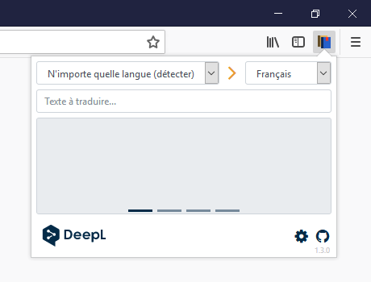
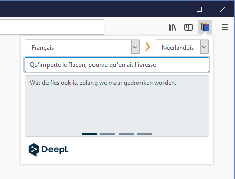

# DeepLT
A simple translation extension for Firefox powered by DeepL

# Screenshot
<<<<<<< HEAD

=======

>>>>>>> 728b7662daa709e163e5cb239b61f6b96c1736c3

## Steps for dev
* Install Node.js & Yarn [https://yarnpkg.com/en/docs/install](https://yarnpkg.com/en/docs/install)
* Launch a cmd window
* Open your clone folder :
```
cd C:\path_to_folder
```
* Get dependencies :
```
yarn
```
* Launch Gulp tasks :
```
yarn gulp
```
* Launch the WebExtension :
```
yarn web-ext run
```

## Firefox Add-ons
[https://addons.mozilla.org/fr/firefox/addon/deeplt/](https://addons.mozilla.org/fr/firefox/addon/deeplt/)

## Specials thanks
* [Deepl Translator](https://www.deepl.com/translator)
* [Mozilla](https://www.mozilla.org)
* [jQuery](https://jquery.com)
* [Bootstrap](https://getbootstrap.com)
* [Yarn](https://yarnpkg.com)
* [Gulp](https://gulpjs.com)
